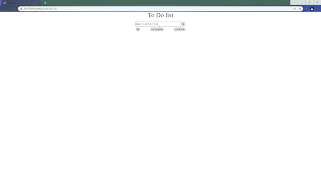
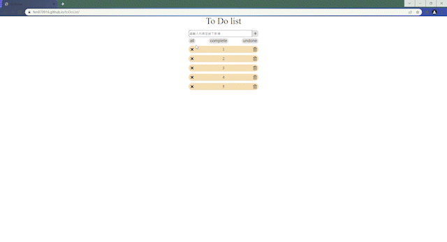
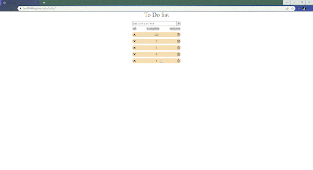
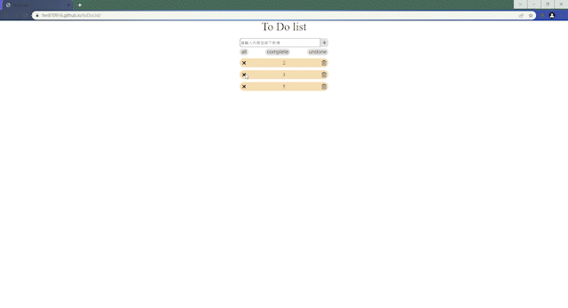
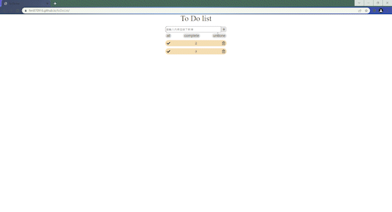

<h1>toDoList</h1>
    前往<a href="https://fen870916.github.io/toDoList/"
      >作品</a
    >
    <h2>功能</h2>
    <h3>新增</h3>
    <li>輸入非空白文字後按下+按鈕即可新增事項</li> 
     
    <h3>編輯</h3>
    <li>按下文字框後可以編輯，編輯時事項會呈現不同顏色</li> 
    
    <li>編輯完按其他區域即編輯完成</li> 
    
    <li>編輯所輸入的文字不能為空白</li> 
    <h3>刪除</h3>
    <li>刪除選項</li> 
     
    <h3>狀態</h3>
    <li>按下X可改變狀態</li> 
     
    <h3>狀態分類</h3>
    <li>按下上方all可查看所有事項</li> 
    
    <li>按下上方complete可查看已完成事項</li> 
    
    <li>按下上方undone可查看未完成事項</li> 
    
